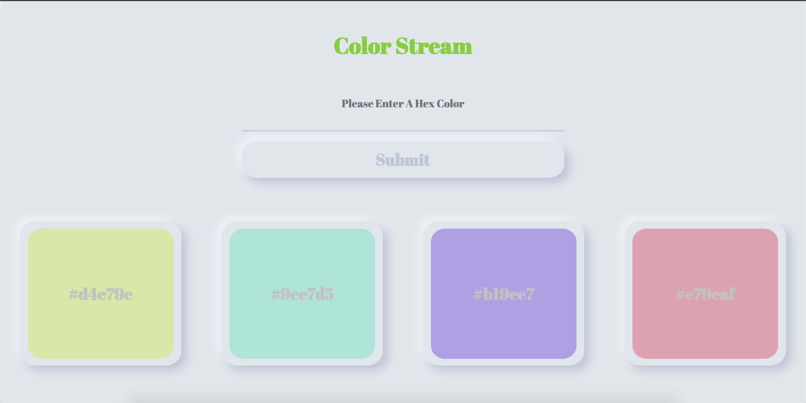

# Color Stream
Color Stream is a basic color scheme generator. Enter in a hex code to see four aligned Tetradic colors with their respective hex codes. It was built in three hours as the first part of MintBean & Turing School of Software and Design's hackathon collaboration. 

View the live page here: https://joel-oe-lacey.github.io/colorstream/

## Development
This project utilizes React with Jest & Enzyme for testing. It incorporates [TinyColor](https://github.com/bgrins/TinyColor) for color scheme generation and some of the dynamic styling. 

Users can input a hex code through a validated controlled form, this will update the button color on submission to show which color was chosen. Users are then presented with four aligned colors and their hex codes in the display below. 

As this was quickly put together, I aimed at a few specific learning goals and basic MVP generation. I used the opportunity to play around with some new styling principals I have been exploring including Neumorphic design and a few dynamic styling tricks and animations.

## Future Iterations
Given the limited time this was developed in there are several points where the UX/UI could be improved:
- It would be nice for users to have a random color button.
- It would also be nice to offer users color selection utilizing color picker instead of manual text Hex entry.
- There are a variety of color pairing styles within TinyColor that could be visualized other than Tetradic.
- Sometimes color contrast offers low readability currently.
